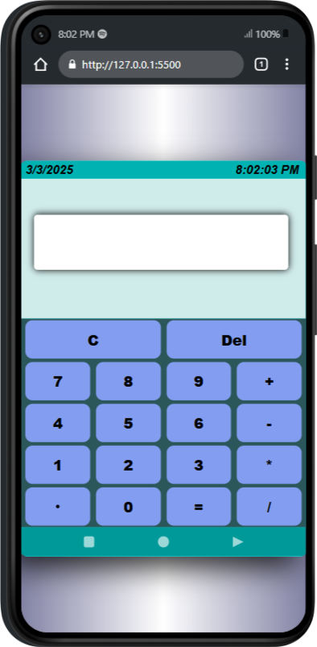
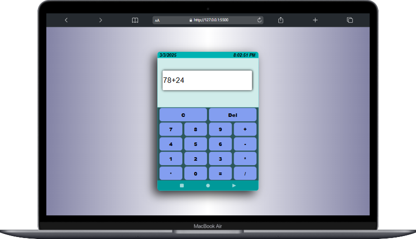

# Calculator Web Application

By, Subhadip Maity

This is a simple calculator web application that allows users to perform basic arithmetic operations. The application includes a navigation bar, a display, a keypad, and features for clearing and deleting input, as well as displaying the current date and time.

## Table of Contents
- [Installation](#installation)
- [Features](#features)
- [Navigation Bar](#navigation-bar)
- [Project Structure](#project-structure)
- [Images](#images)
- [How It Works](#how-it-works)
- [How to Use](#how-to-use)
- [Customization](#customization)
- [Future Enhancements](#future-enhancements)
- [Contact](#contact)

## Installation
1. Clone the repository:
    
```sh
   git clone https://github.com/SontuCoder/Simple-Calculator.git
```
---
## Features

- **Basic Arithmetic Operations:** Supports addition, subtraction, multiplication, and division.
- **Real-time Date and Time:** Displays the current date and time, which updates every second.
- **Clear and Delete:** Options to clear the entire input or delete the last character.
- **Responsive Design:** The layout is designed to be responsive, ensuring a good user experience on different devices.
- **Navigation Bar:** Provides easy navigation and displays the title of the application.

---
## Navigation Bar

The navigation bar is included at the top of the application and contains the following elements:
- **Title:** Displays the name of the application.
- **Date and Time:** Real-time display of the current date and time.

---
## Project Structure

- **index.html:** The main HTML file that structures the layout of the calculator and navigation bar.
- **style.css:** The CSS file that styles the calculator's interface and navigation bar.
- **apps.js:** The JavaScript file that handles the calculator's functionality, including input handling, arithmetic operations, and real-time date and time updates.

---
## Images

Below are some images demonstrating the calculator application:

- Interface in Mobile Devices


- Interface in Laptop Devices


---
## How It Works

1. **Date and Time:**
   - The current date is displayed in the `#current_date` element in the format `DD/MM/YYYY`.
   - The current time is updated every second in the `#current_time` element using JavaScript's `setInterval` function.

2. **Display:**
   - User inputs are displayed in the text field with the class `input`.
   - The display is updated as the user clicks the buttons on the keypad.

3. **Keypad Functionality:**
   - **Number and Operator Buttons:** When a user clicks a number or operator button, the corresponding value is appended to the display.
   - **Clear (`C`) Button:** Clears the entire display.
   - **Delete (`Del`) Button:** Deletes the last character in the display.
   - **Equal (`=`) Button:** Evaluates the expression shown in the display and shows the result.

---
## How to Use

1. Open `index.html` in a web browser.
2. Use the navigation bar to view the application title and current date and time.
3. Use the buttons on the keypad to input your desired arithmetic expression.
4. Click the `=` button to calculate the result.
5. Use the `C` button to clear the display or the `Del` button to delete the last character.

---
## Customization

You can modify the styles in `style.css` to change the appearance of the calculator and navigation bar. The JavaScript functions in `apps.js` can also be extended to add more features like advanced mathematical functions.

---
## Future Enhancements

- Add support for advanced mathematical operations like square root, exponentiation, and trigonometric functions.
- Improve UI/UX with animations and better responsiveness.
- Implement keyboard support for inputting expressions.
- Add a dark mode toggle.

---
## Contact

If you have any questions or feedback, feel free to reach out:
- Email: [subhadipmaity792@gmail.com](mailto:subhadipmaity792@gmail.com)
- GitHub: [SontuCoder](https://github.com/SontuCoder)


